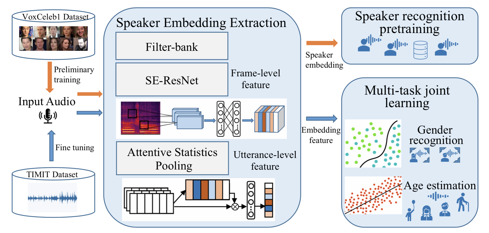

<!--
 * @Descripttion: Code for the paper of multi-task learning based gender recognition and age estimation task
 * @version: V1.0.1
 * @Author: P.Yang
 * @Date: 2021-10-06 19:43:03
 * @LastEditors: yp
 * @LastEditTime: 2021-10-09 22:31:35
-->
# Multi-task Learning Based Gender Recognition and Age estimation
## Introduction


This repository contains the official implementation of joint gender recognition and age estimation proposed in the ICASSP 2022 paper (P. Yang, W.Q.Zheng, et al.).

Automatic gender recognition and age estimation from speaker's audio is desired by applications in music recommendation, speaker profiling etc. However, limited training data and the class-imbalanced data distribution often greatly degrade its performance. This repository explores a novel multi-task learning based gender recognition and age estimation system using speaker embedding. The label distribution smoothing method and a weight mean squared error focal loss have been applied during training. Specifically, it pretrains a deep convolution neural network stacked with an attentive statistics pooling layer for speaker recognition task on a speaker speech dataset to extract robust speaker embedding. It further fine-tunes the multi-task learning network for joint gender recognition and age estimation simultaneously using classifier and regressor on TIMIT, respectively. It achieves new state-of-the-art results on the TIMIT dataset with RMSE of 7.17 and 7.25 years on age estimation for male and female speakers, respectively, while performs an overall gender recognition accuracy of 99.30%.

## Getting Started

>Note: You can download our trained speaker model and start from step 5 if you only want to use Age and Gender predict system .You can also train the speaker model from Step 2

### 1. Environment Setup


```
$ pip install -r ./requirements.txt
```


### 2. Generate speaker train lists

```
$ python ./datapre.py --train_list <voxceleb1_train> 
```
Train lists and trial file for speaker verification model is generated by this step.

### 3. Pre-train the model

```
$ python ./trainSpeakerNet.py --model ResNetSE34v2 --log_input True --encoder_type ASP --trainfunc amsoftmax --save_path <path_to_save> --nClasses 3014 --augment True --n_mels 80 --lr_decay 0.2 --test_interval 15 --lr 0.01 --batch_size 512 --scale 32 --margin 0.2 --train_list <list_pretrain> --test_list <pvtc_trials> --train_path <train_path> --test_path <test_path> --musan_path <musan_path> --rir_path <rir_path> --optimizer sgd 
```

The pre-train list <list_pretrain> should contain the identity and the file path, one line per utterance, as follows:
```
spker001 spker001_000001.wav
spker001 spker001_000002.wav
spker001 spker001_000003.wav

```
In our system, We use voxceleb1 as the pre-train data. The pre-train data we use can be found in [here](http://www.openslr.org/49/).


More detailed information of setting parameters can be find in 


### 4. Fine-tuning the Age and gender model
```
$python ./lr_fintune.py  --optimizer sgd --scheduler steplr --lr 0.001 --age_Classes 1 --max_frames 500 --gender_Classes 2 --save_path <model save pat> --train_list <train set>  --test_list <test set> --musan_path <musan_path> --rir_path <rir_path> --optimizer sgd --log_input False  --n_mels 80 --encoder_type ASP --nOut 512 --use_gpu 1 --batch_size 24 --flag 1 --max_epoch 100  --initial_model <pretrain model> --trainfunc aamsoftmax --newtrainfunc no_sigmoid --weight 7  --lr_decay 0.9 --loss_type focal_mse_loss --max_epoch 100 --tm 1.0 
```
The train list <list_train> should contain the identity and the file path, one line per utterance, as follows:
```
MEDR0 /data/pineyang/ft_local/TRAIN/MEDR0/SX204.wav 27.140 male
MSAT1 /data/pineyang/ft_local/TRAIN/MSAT1/SI1703.wav 29.619 male
MRJB1 /data/pineyang/ft_local/TRAIN/MRJB1/SX390.wav 25.118 male
```
The setting parameters as follows:
```
--save_path     train model save path
--log_input     if True,the fbank feature is extracted,if False,the melspectrum is extracted
--encoder_type  the pooling method
--flag whether  pre-training is required
--loss_type     the loss function for age prediction
--weight        age loss weight value
--tm            focal mse parameters
```
### 4. Result
| Model | male_mae | male_rmse | female_mae | female_rmse | gender acc |
| :-----|:----: | :----: |:----: | :----: | :----: |
| baseline |`5.12` |7.24 |`5.29` |8.12 |`99.60%` |
| ours |5.25 |`7.17` |`5.29` |`7.25` |99.30% |


**note**: The result of the baseline could be downloaded [here](https://www.mdpi.com/1424-8220/21/14/4785/xml) 

## Contact
If you have a question, please bring up an issue (preferred) or send us an email 643532644@qq.com or joewzheng@tencent.com.